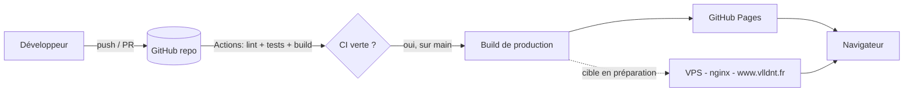
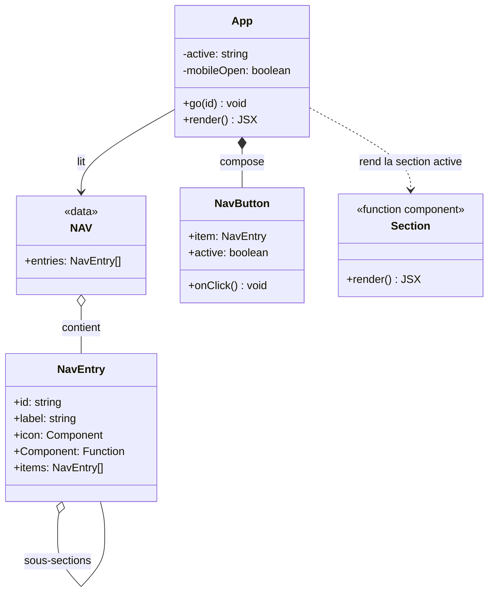
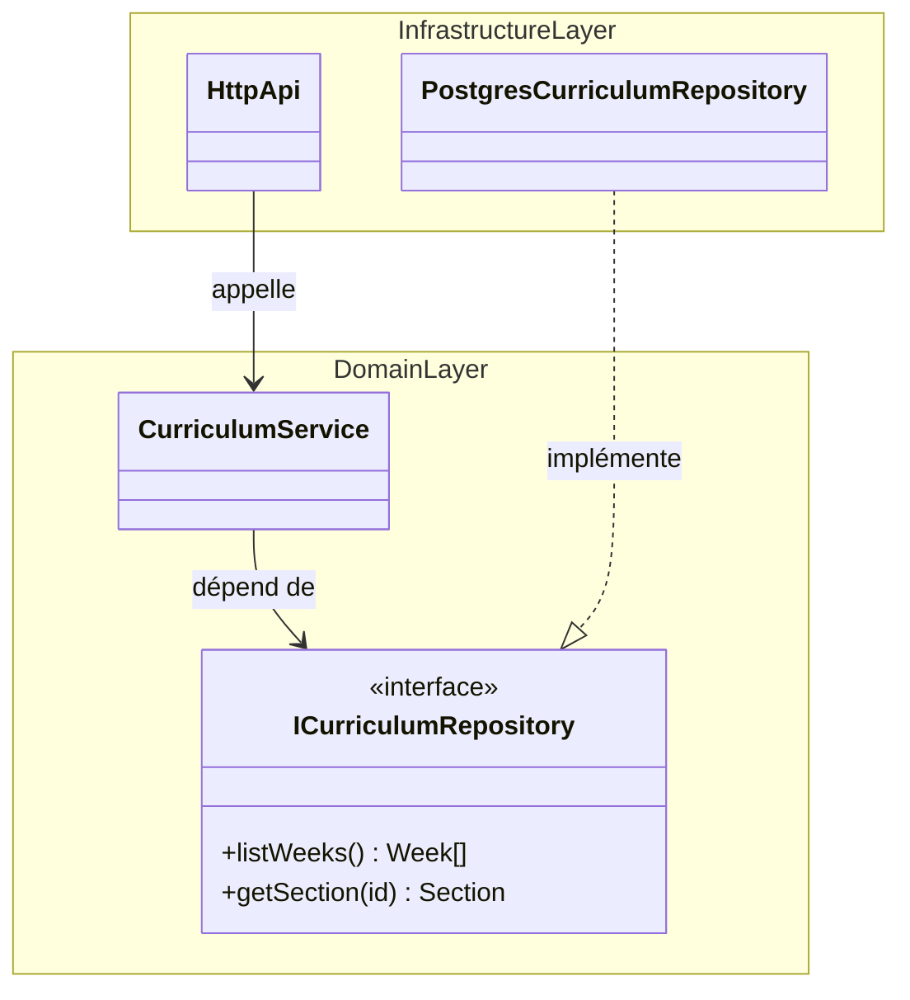
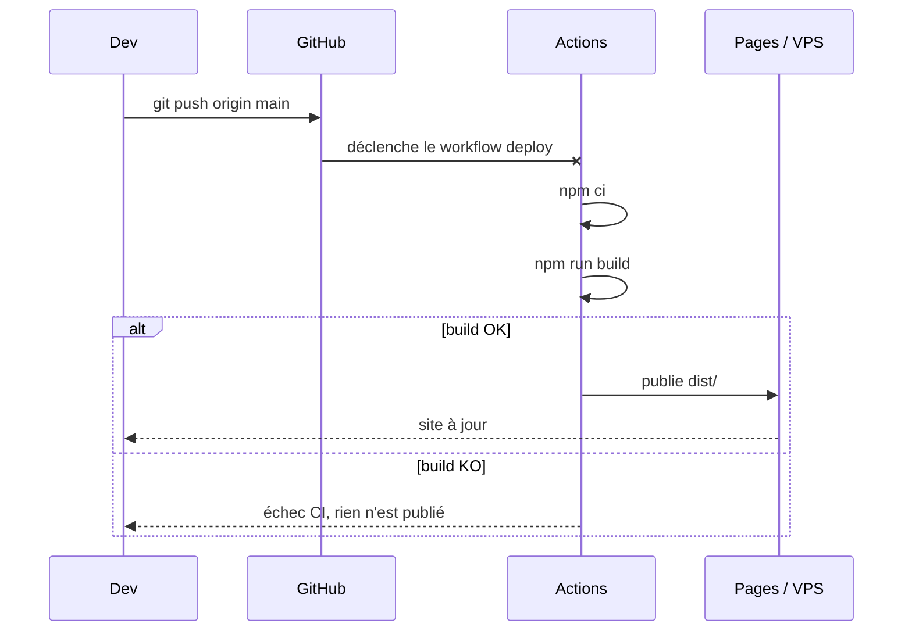
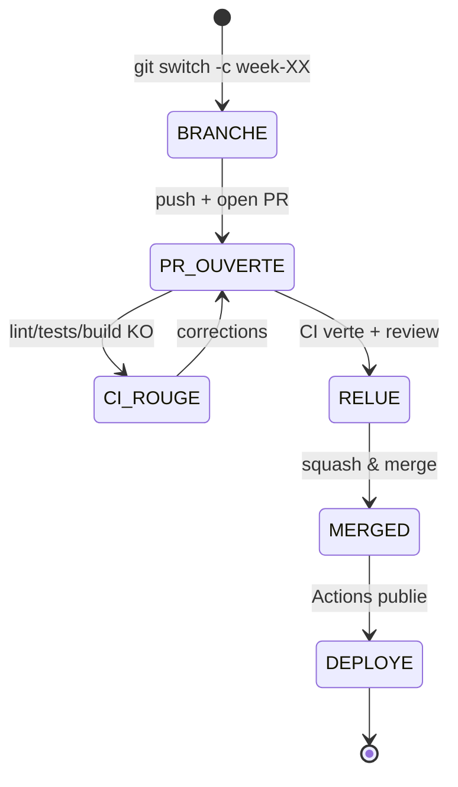

# Architecture

Documentation vivante du projet. Les diagrammes sont en **Mermaid**, rendus
nativement par GitHub — mêmes conventions que les diagrammes du site.

## 1. Vue d'ensemble (statique)

## 2. Modèle de composants (React)

Le site est une seule application React. Une donnée (`NAV`) décrit la
navigation ; `App` garde l'état de la section active et rend le composant
correspondant.

## 3. Inversion des dépendances (cible backend)

Si un backend est ajouté (VPS), le domaine ne dépend pas de l'infrastructure :
il définit une interface, l'infra l'implémente.

## 4. Séquence — déploiement automatique

## 5. États d'une contribution hebdomadaire

## 6. Dictionnaire de données (cohérence inter-modèles)

Un concept = un nom canonique = un type, dans **toutes** les couches.

| Concept | Nom canonique | Type | SQL (`docs/data-model.sql`) | OpenAPI (`docs/openapi.yaml`) | UI (`src/App.jsx`) |
| --- | --- | --- | --- | --- | --- |
| Identifiant de section | `section_id` | `slug` (`^[a-z0-9-]+$`) | `section.section_id` | `Section.sectionId` | `NAV[].items[].id` |
| Titre de section | `section_title` | `string` | `section.title` | `Section.title` | `H2` de la section |
| Numéro de semaine | `week_number` | `integer >= 1` | `week.week_number` | `Week.number` | `docs/curriculum.md` |
| URL de ressource | `resource_url` | `uri` | `resource.url` | `Resource.url` | `SourceLink href` |
